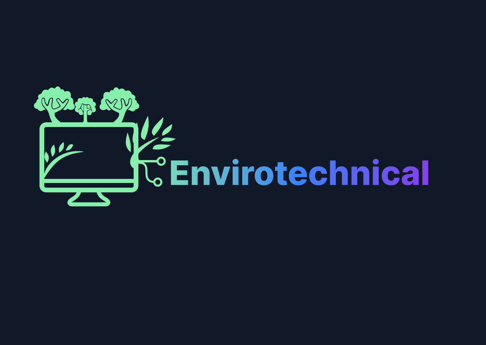

# Envirotechnical

This is a website created on the occasion of the Codemotion Milan 2022 from the talk of Lorenzo Pieri. 

<div>
 
</div>

## Table of contents

<!-- TABLE OF CONTENTS -->
<details>
  <summary>Table of Contents</summary>
  <ol>
    <li>
        <a href="#about-the-project">About The Project</a>
    </li>
    <li>
      <a href="#getting-started">Getting Started</a>
      <ul>
        <li><a href="#prerequisites">Prerequisites</a></li>
        <li><a href="#installation">Installation</a></li>
      </ul>
    </li>
    <li><a href="#roadmap">Roadmap</a></li>
    <li><a href="#contributing">Contributing</a></li>
    <li><a href="#license">License</a></li>
    <li><a href="#team">Team</a></li>
  </ol>
</details>

## About the Project
The project's purpose is to grow awareness around the impact of the web on climate change. This site will be a place where you can find resources for a sustainable web and a place where to share our experiences and frustration about it. 

## Getting started

Envirotechnical is built using the [javascript](https://www.javascript.com/) ecosystem. It requires a javascript runtime, check the [prerequisites](#prerequisites) paragraph.

### Prerequisites

This project requires you to have the following tools installed already:

* [Node](https://nodejs.org/) v14 ( or [equivalent](https://bun.sh/) javascript runtime )
* [NPM](https://www.npmjs.com/) v6 (  or [equivalent](https://yarnpkg.com/) package manager)

You can check your Node.js and NPM version by typing:

```bash
$ node -v

$ npm -v
```

### Installation

You can use your preferred package manager to install the project

```bash
npm install

#or 
yarn add
```

### Run the project

```
npm run build
npm start
```

<p align="right">(<a href="#readme-top">back to top</a>)</p>

## Roadmap

<p align="right">(<a href="#readme-top">back to top</a>)</p>

## Contributing

Contributions are welcome and wanted. To submit your code, please make sure you read our [CONTRIBUTING](./CONTRIBUTING.md) guidelines.

Run npm lint and npm build before submitting your merge request.

<p align="right">(<a href="#readme-top">back to top</a>)</p>

## License

<!-- This software is distributed under a [MIT](https://choosealicense.com/licenses/mit/) license that can be found [here](./LICENSE) -->

<p align="right">(<a href="#readme-top">back to top</a>)</p>

## Team

- [Lorenzo Pieri - 404answernotfound](https://github.com/404answernotfound)
- [Angela Busato - AngyDev](https://github.com/AngyDev)

<p align="right">(<a href="#readme-top">back to top</a>)</p>
